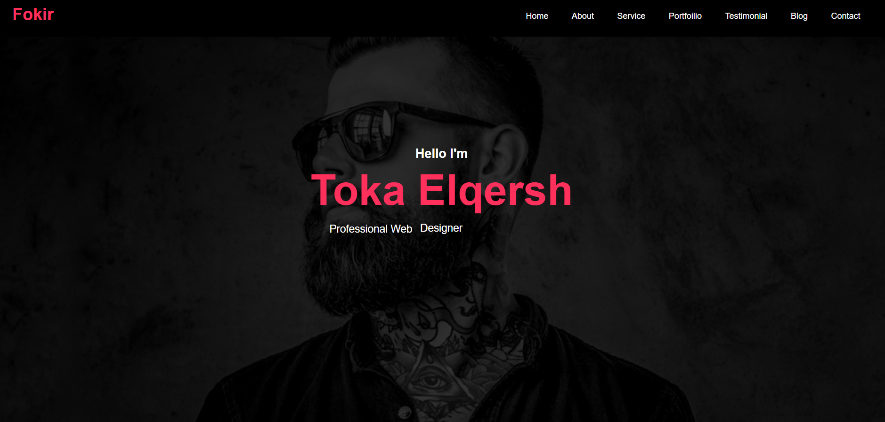

# Assignment 4 - Route Academy Course 

Welcome to my **Assignment 4** repository! This project is part of my current course at **Route Academy**. In this assignment, I built a simple yet elegant webpage using **HTML** and **CSS**. Below is a breakdown of the sections included in this project:
<br>
<br>


---

## Sections Overview 🗂️

1. **Home Section 🏠**  
   - A simple introduction with my name and a subtle animation to make it visually appealing.

2. **About Me Section 👤**  
   - A short description about myself, highlighting key details.

3. **Our Services Section 🛠️**  
   - A brief overview of the services I (or my team) offer.

4. **Portfolio Section 🖼️**  
   - A gallery of images showcasing my work. No descriptions here—just visuals to speak for themselves!

5. **Client Feedback Section 💬**  
   - Testimonials or feedback from clients to build trust and credibility.

6. **Contact Us Section 📞**  
   - A section dedicated to getting in touch with me. Feel free to reach out!

---

## Technologies Used 💻

- **HTML**: For structuring the webpage.
- **CSS**: For styling and adding animations.

---

## How to Use 🛠️

1. Clone the repository:
   ```bash
   git clone https://git@github.com:toka09/Fokir.git
